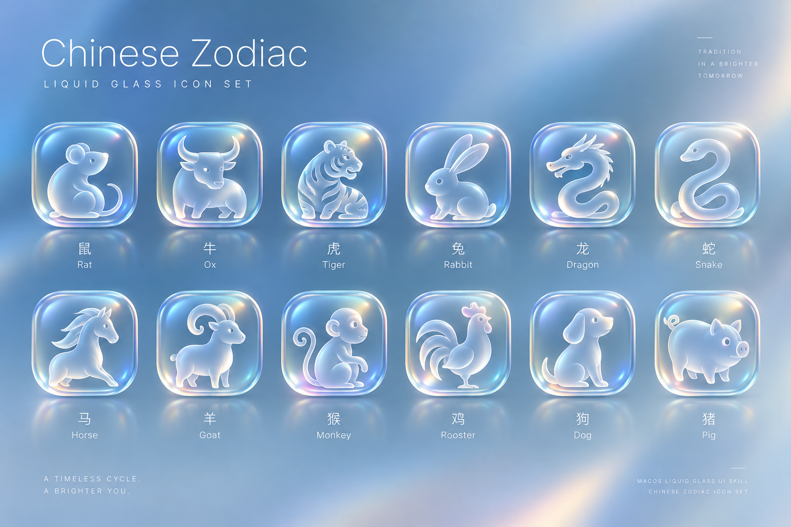

# macOS Liquid Glass Skills

让 AI Agent 为不同产品设计、实现和审查一致的 **macOS / Apple Liquid Glass 风格 UI 与 App Icon**。

这不是一份单纯的“毛玻璃配色表”。仓库的目标是把 Liquid Glass 拆成 Agent 可执行的：

- 视觉与材质语义；
- 页面范式与窗口信息架构；
- Toolbar / Sidebar / Inspector / Search / Menu / Commands；
- 完整组件与状态覆盖；
- 滚动、短屏、窄屏与 200% 缩放；
- Accessibility 与系统偏好；
- Web 框架适配；
- SwiftUI / AppKit 原生实现边界；
- App Icon / Icon Composer 生产交付；
- Anti-patterns、Evals 与验收。

本仓库与 Apple 无隶属关系。Web 视觉参数与 AI 生图参数属于本项目设计基线，不是 Apple 官方固定值；原生行为最终以当前 Apple SDK 与官方文档为准。

---

## 三个独立 Skill

### 1. `macos-liquid-glass-ui`

面向 **Web / Electron / Tauri Web UI / 跨端 Web 视觉层**。

负责：

- Liquid Glass 内容层 / 功能层语义；
- Web 材质近似与 fallback；
- 页面范式；
- Window-like 信息架构；
- Toolbar、Sidebar、Inspector、Search；
- 组件、表格、图表、表单、浮层；
- 稳定底部操作区；
- 滚动、响应式、短屏与 200% 缩放；
- Accessibility；
- Vue / Element Plus / React / Tailwind / ECharts / Electron 等适配；
- Anti-patterns 与验收。

不负责原生 SwiftUI/AppKit，也不负责 App Icon。

### 2. `macos-liquid-glass-native-ui`

面向 **原生 macOS SwiftUI / AppKit / hybrid**。

负责：

- 系统组件优先的 Liquid Glass 实现；
- Window、Toolbar、Sidebar、Inspector；
- Search、Menu、Commands、Keyboard shortcuts；
- Sheet、Popover、Panel；
- 多窗口与 selection ownership；
- Reduce Transparency / Increase Contrast / Reduce Motion / Show Borders 等系统适配；
- 原生窗口与命令验收。

核心原则：**系统已经会做的 Liquid Glass，不再手工画第二层。**

### 3. `macos-liquid-glass-icon`

面向 **App Icon / 产品图标**。

负责：

- 产品隐喻与轮廓；
- 统一 palette / layer / material；
- ChatGPT 内置图像生成；
- 图标家族一致性；
- 小尺寸 QA；
- Icon Composer 分层 handoff。

不用于普通 16–24px Toolbar 图标。

---

# 快速安装

先查看仓库可用 Skill：

```bash
npx skills add Inupedia/macos-liquid-glass-ui-skill --list
```

安装 Web UI Skill：

```bash
npx skills add Inupedia/macos-liquid-glass-ui-skill --skill macos-liquid-glass-ui
```

安装原生 macOS Skill：

```bash
npx skills add Inupedia/macos-liquid-glass-ui-skill --skill macos-liquid-glass-native-ui
```

安装 App Icon Skill：

```bash
npx skills add Inupedia/macos-liquid-glass-ui-skill --skill macos-liquid-glass-icon
```

全局安装给 Codex / Cursor：

```bash
npx skills add Inupedia/macos-liquid-glass-ui-skill \
  --skill macos-liquid-glass-ui \
  --agent codex cursor \
  --global
```

把 `--skill` 替换成另外两个 Skill 名称即可。

---

# 直接让 Agent 安装

```text
请从 https://github.com/Inupedia/macos-liquid-glass-ui-skill 安装需要的 Skill：

- Web / Electron / Tauri UI：skills/macos-liquid-glass-ui/
- 原生 SwiftUI / AppKit：skills/macos-liquid-glass-native-ui/
- App Icon：skills/macos-liquid-glass-icon/

请保留完整 Skill 目录，包括 SKILL.md、agents/、references/、assets/（若存在）和 evals/（若存在）。
不要只复制 SKILL.md。

如果已有同名且经过本地修改的 Skill，请先比较差异，不要直接覆盖。
```

---

# 手动安装

| Agent | Web UI | Native UI | App Icon |
| --- | --- | --- | --- |
| Codex | `$CODEX_HOME/skills/macos-liquid-glass-ui/` | `$CODEX_HOME/skills/macos-liquid-glass-native-ui/` | `$CODEX_HOME/skills/macos-liquid-glass-icon/` |
| Cursor | `~/.cursor/skills/macos-liquid-glass-ui/` | `~/.cursor/skills/macos-liquid-glass-native-ui/` | `~/.cursor/skills/macos-liquid-glass-icon/` |

Cursor 也支持项目级 `.cursor/skills/<skill-name>/`。

---

# Web UI Skill

## 设计目标

`macos-liquid-glass-ui` 不只是让页面“看起来像 Mac”。它要求 Agent 同时处理：

1. 内容层与功能层；
2. 页面范式；
3. 布局与滚动合同；
4. 材质选择；
5. 完整组件状态；
6. 平台式导航与输入模型；
7. Accessibility；
8. Anti-pattern 检查；
9. 实际验收。

## Liquid Glass 的核心边界

默认：

- Toolbar / Sidebar / floating controls / Popover：可以使用 Liquid Glass；
- 正文 / Table / Chart / long form：稳定内容 surface；
- `glass-clear`：只用于图片、地图、视频等视觉丰富背景上的少量控制；
- 不做满屏 glass cards；
- 不做 glass-on-glass；
- 不添加无功能的 traffic lights 或 Dock。

## 页面范式

内置范式包括：

- Document / Reading
- Finder-style Browser
- Settings
- Data Dashboard
- IDE / Workbench
- Chat / Agent
- Media / Map / Canvas
- Form Workflow
- Table-centric Admin
- Landing / Presentation

Agent 应先选择主范式，再画布局，而不是默认所有产品三栏。

## 完整组件覆盖

覆盖：

- Actions
- Selection
- Inputs
- Navigation
- Lists / Tables / Trees / Cards
- Feedback
- Overlays
- Search / Filter
- Charts
- Canvas / Flow / Map
- File / Asset
- AI / Agent
- Developer / Professional tools
- Empty states
- Density

完整规范不等于把所有组件都塞进项目。Agent 只展开真实业务会使用的部分。

## Web 框架适配

实现参考覆盖：

- Vanilla CSS
- Vue 3
- Element Plus
- React
- Tailwind
- Headless UI / Radix / Ark 类组件
- ECharts / Chart.js / D3
- Electron / Tauri

原则：**映射现有 token 和组件库，而不是为了换视觉重写业务架构。**

## 示例 Prompt

### 完整规范

```text
使用 $macos-liquid-glass-ui，为一个知识管理 Web 产品生成完整 Liquid Glass UI 规范。
要求足够充足：包含材质语义、页面范式、Toolbar/Sidebar/Search、完整组件覆盖、
滚动与短屏规则、200% 缩放、Accessibility、Anti-patterns 和验收。
这次只输出规范，不改代码。
```

### 现有项目改造

```text
使用 $macos-liquid-glass-ui 完善当前 Vue + Element Plus 项目。
保留现有组件库、路由和数据逻辑，先检查 token、布局和滚动归属，再渐进实施。
Table、Chart 和正文保持稳定内容层，Liquid Glass 主要用于 Toolbar、Sidebar 和浮动控制。
```

### 审查

```text
使用 $macos-liquid-glass-ui 审查当前界面，先不要改代码。
重点检查全页玻璃化、glass-on-glass、三栏滥用、嵌套滚动、Toolbar 过载、
短屏裁切、200% 缩放、Reduce Transparency、键盘焦点和关键错误只用 Toast。
```

---

# Native macOS Skill

`macos-liquid-glass-native-ui` 专门避免一个常见问题：**把 Web 的 `backdrop-filter` 思路直接搬进 SwiftUI/AppKit。**

## 核心原则

- 标准组件优先；
- Toolbar / Navigation / system controls 已经获得系统外观时，不重复叠 glass；
- 内容区不整块 glass；
- Commands / Menu / Toolbar / Keyboard shortcut 状态一致；
- Window resize 是默认前提；
- 多窗口时区分 app-global 与 window-local state；
- 自定义控件响应系统 accessibility 环境。

## 示例 Prompt

```text
使用 $macos-liquid-glass-native-ui 现代化当前 SwiftUI macOS 项目。
优先使用系统 Toolbar、Sidebar、Search、Button 和 Menu/Commands，不手工复刻系统玻璃。
请检查最小窗口、Toolbar overflow、Sidebar/Inspector、键盘、Reduce Transparency、
Increase Contrast、Show Borders 和多窗口状态，并报告实际验证范围。
```

```text
使用 $macos-liquid-glass-native-ui 审查这个 AppKit 老项目。
不要重写现有架构，优先复用 NSToolbar、NSSplitViewController、系统 List/Table 和命令体系，
找出哪些自定义 blur/glass 可以删掉，哪些浮动控制确实需要保留。
```

---

# App Icon Skill

`macos-liquid-glass-icon` 用于 App Icon / 产品图标。

核心流程：

1. 提取产品语义；
2. 选择一个核心隐喻；
3. 冻结 silhouette；
4. 冻结 2–4 层 layer system；
5. 冻结 HEX palette；
6. 使用宿主图像生成；
7. 小尺寸 QA；
8. 给出 Icon Composer layer map。

不调用第三方图像 API，不要求 API Key。

## Generated Example — Chinese Zodiac



这组图标用于验证 icon family 的 palette、材质、视角和细节密度一致性。AI 生成 PNG 属于视觉稿；真实 Apple App Icon 上线前仍需通过 Icon Composer / Xcode 生产验证。

## 示例 Prompt

```text
使用 $macos-liquid-glass-icon，为当前产品设计并直接生成一个 Liquid Glass 风格 App Icon。
先确定一个核心隐喻和强轮廓，再生成 1024x1024 单图。
要求 64px 和 32px 仍能辨认，并给出 Icon Composer 分层说明。
```

```text
使用 $macos-liquid-glass-icon，为这一组产品入口图标建立统一 style spec。
锁定 palette、layer count、视角、材质和细节预算，再逐个生成。
```

---

# 仓库结构

```text
skills/
├── macos-liquid-glass-ui/
│   ├── SKILL.md
│   ├── agents/openai.yaml
│   ├── assets/
│   │   └── foundation.css
│   ├── evals/
│   │   └── core.jsonl
│   └── references/
│       ├── visual-system.md
│       ├── materials-and-optics.md
│       ├── layout-and-scroll.md
│       ├── window-and-navigation.md
│       ├── components-and-states.md
│       ├── component-matrix.md
│       ├── accessibility.md
│       ├── page-archetypes.md
│       ├── anti-patterns.md
│       ├── implementation-adapters.md
│       └── validation.md
│
├── macos-liquid-glass-native-ui/
│   ├── SKILL.md
│   ├── agents/openai.yaml
│   ├── evals/
│   │   └── core.jsonl
│   └── references/
│       ├── swiftui-appkit.md
│       ├── native-structure.md
│       └── validation.md
│
└── macos-liquid-glass-icon/
    ├── SKILL.md
    ├── agents/openai.yaml
    └── references/
        ├── icon-system.md
        ├── prompt-template.md
        └── validation.md
```

---

# Progressive Disclosure

本仓库刻意不把所有规则塞进一个超长 `SKILL.md`。

Skill 入口负责：

- 判断是否应该触发；
- 判断 Web / Native / Icon 路由；
- 给出工作顺序；
- 按任务选择最少必要 references。

深层知识放在 `references/`。这样可以继续扩充覆盖面，而不会让每次调用都读取整套设计系统。

---

# Evals

仓库包含行为 eval fixtures，用于防止 Skill 越写越长但能力反而退化。

当前覆盖示例包括：

- Web vs Native vs Icon 路由；
- 全页玻璃化；
- glass-clear 使用条件；
- Table / Chart 内容层；
- 稳定底部操作；
- 200% 缩放；
- 滚动条系统偏好；
- 假 traffic lights / Dock；
- Chat / Agent 工作台；
- SwiftUI raw glassEffect 滥用；
- Toolbar command parity；
- 多窗口 state ownership；
- Accessibility。

Evals 目前是可检查的 JSONL 测试资产，可继续接入 Agent runner 做自动评分。

---

# CI

`.github/workflows/validate-skills.yml` 会检查：

- 每个 Skill 是否有 `SKILL.md`；
- frontmatter `name` 是否与目录一致；
- description 是否存在；
- `agents/openai.yaml` 是否存在；
- `SKILL.md` 引用的本地 references/assets 是否存在；
- eval JSONL 是否能解析；
- eval id 是否重复；
- `expected_skill` 是否指向真实 Skill。

它不替代视觉 QA，但可以避免文档路由和测试资产在仓库演进中悄悄坏掉。

---

# Apple 官方参考

需要核实当前系统行为时，以 Apple 官方资料为准：

- [Human Interface Guidelines](https://developer.apple.com/design/human-interface-guidelines/)
- [Materials](https://developer.apple.com/design/human-interface-guidelines/materials)
- [Designing for macOS](https://developer.apple.com/design/human-interface-guidelines/designing-for-macos/)
- [Toolbars](https://developer.apple.com/design/human-interface-guidelines/toolbars)
- [Sidebars](https://developer.apple.com/design/human-interface-guidelines/sidebars)
- [Searching](https://developer.apple.com/design/human-interface-guidelines/searching)
- [Liquid Glass technology overview](https://developer.apple.com/documentation/technologyoverviews/liquid-glass)
- [App icons](https://developer.apple.com/design/human-interface-guidelines/app-icons)
- [Icon Composer](https://developer.apple.com/icon-composer/)

---

# 更新

```bash
npx skills update macos-liquid-glass-ui
npx skills update macos-liquid-glass-native-ui
npx skills update macos-liquid-glass-icon
```

安装成功只表示 Agent 能读取 Skill；最终产品仍需要真实窗口、真实浏览器/系统设置、目标尺寸和真实业务状态下的验收。
